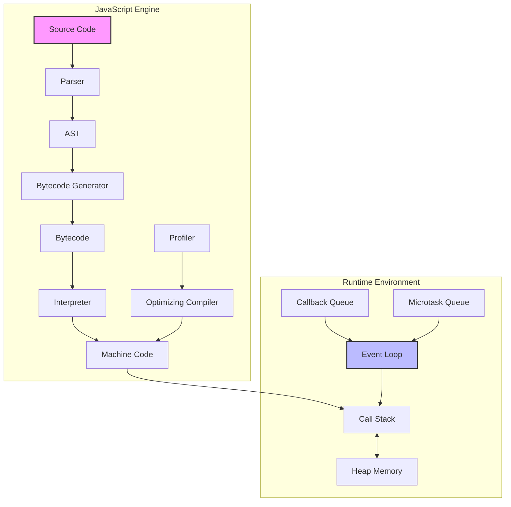

# Reference: JavaScript

```yaml
category: プログラミング言語
version: 2.0.0
last_updated: 2025-08-04
ecma_version: ES2024
```

## 🎯 JavaScriptとは

### 一言での定義

JavaScriptは、動的型付けを持つマルチパラダイムプログラミング言語で、主にウェブブラウザでのクライアントサイドスクリプティングに使用されますが、Node.jsによりサーバーサイド開発も可能です。ECMAScript仕様（現在ES2024）に基づき、プロトタイプベースのオブジェクト指向、関数型、命令型プログラミングをサポートします。

### なぜ重要なのか

JavaScriptは以下の理由で現代のソフトウェア開発において不可欠です：

1. **ユニバーサルランタイム**: すべての主要ブラウザ（Chrome V8、Firefox SpiderMonkey、Safari JavaScriptCore）で動作
2. **フルスタック開発**: Node.js（V8エンジンベース）により、フロントエンドとバックエンドを同一言語で開発可能
3. **非同期プログラミング**: イベントループとPromise/async-awaitによる効率的な非同期処理
4. **豊富なエコシステム**: npm（Node Package Manager）には200万以上のパッケージが存在
5. **パフォーマンス**: JITコンパイラによる高速実行、WebAssemblyとの連携

### 歴史的背景と仕様

JavaScriptは1995年にBrendan EichがNetscape Navigator 2.0のために10日間で開発しました。主要なマイルストーン：

- **1997年**: ECMAScript 1.0標準化
- **2009年**: ES5（strict mode、JSON、Array methods）
- **2015年**: ES6/ES2015（let/const、Arrow functions、Classes、Modules）
- **2017年**: ES2017（async/await）
- **2020年**: ES2020（Optional chaining、Nullish coalescing）
- **2024年**: ES2024（Array grouping、Promise.withResolvers）

## 📚 基本用語・概念

### 技術用語集

| 用語 | 読み方 | 定義 | 技術詳細 |
|------|--------|------|----------|
| 変数（Variable） | へんすう | 値への名前付き参照 | let（ブロックスコープ）、const（再代入不可）、var（関数スコープ、非推奨） |
| 関数（Function） | かんすう | 再利用可能なコードブロック | Function declaration、Function expression、Arrow function |
| オブジェクト（Object） | おぶじぇくと | キー・値ペアのコレクション | プロトタイプチェーン、ディスクリプタ、Proxy |
| 配列（Array） | はいれつ | 順序付きコレクション | 動的配列、sparse array対応、Array.prototype methods |
| イベント（Event） | いべんと | ユーザーまたはシステムアクション | Event bubbling/capturing、CustomEvent API |
| DOM | でぃーおーえむ | Document Object Model | W3C標準、ツリー構造、ノード操作API |
| Promise | ぷろみす | 非同期操作の最終的な完了/失敗 | Pending、Fulfilled、Rejected状態 |
| クロージャ（Closure） | くろーじゃ | 関数と参照環境の組み合わせ | レキシカルスコープ、メモリ管理 |
| プロトタイプ（Prototype） | ぷろとたいぷ | オブジェクトの継承メカニズム | [[Prototype]]内部スロット、プロトタイプチェーン |
| イベントループ（Event Loop） | いべんとるーぷ | 非同期実行モデル | Call stack、Task queue、Microtask queue |

### 技術アーキテクチャ



## 🔍 核心概念の詳細

### 中心となる原理・原則

#### 1. 型システムとデータ型

JavaScriptは動的型付け言語で、実行時に型が決定されます。

**プリミティブ型（7種類）**:
```javascript
// 1. Number - IEEE 754倍精度浮動小数点
const integer = 42;
const float = 3.14159;
const scientific = 1.23e-4;
const binary = 0b1010;  // 10
const octal = 0o755;    // 493
const hex = 0xFF;       // 255

// 特殊な数値
const inf = Infinity;
const negInf = -Infinity;
const notANumber = NaN;

// 2. BigInt - 任意精度整数
const bigInteger = 123456789012345678901234567890n;
const fromNumber = BigInt(Number.MAX_SAFE_INTEGER);

// 3. String - UTF-16文字列
const single = 'Hello';
const double = "World";
const template = `Hello ${single}`;
const multiline = `
    Multiple
    Lines
`;

// 4. Boolean
const isTrue = true;
const isFalse = false;

// 5. Undefined - 未定義値
let uninitialized;
console.log(uninitialized); // undefined

// 6. Null - 意図的な空値
const empty = null;

// 7. Symbol - 一意識別子
const sym1 = Symbol('id');
const sym2 = Symbol('id');
console.log(sym1 === sym2); // false

// Well-known symbols
const iteratorSymbol = Symbol.iterator;
const toStringTagSymbol = Symbol.toStringTag;
```

**型変換と型チェック**:
```javascript
// 暗黙的型変換（Type Coercion）
console.log('5' + 3);        // '53' (文字列連結)
console.log('5' - 3);        // 2 (数値演算)
console.log('5' * '3');      // 15
console.log(true + 1);       // 2
console.log(false + 1);      // 1

// 明示的型変換
const str = String(123);
const num = Number('123');
const bool = Boolean(0);     // false

// 型チェック
console.log(typeof 42);              // 'number'
console.log(typeof 'hello');         // 'string'
console.log(typeof true);            // 'boolean'
console.log(typeof undefined);       // 'undefined'
console.log(typeof null);            // 'object' (歴史的バグ)
console.log(typeof {});              // 'object'
console.log(typeof []);              // 'object'
console.log(typeof function(){});    // 'function'

// より正確な型チェック
console.log(Array.isArray([]));     // true
console.log([] instanceof Array);    // true
console.log(Object.prototype.toString.call([])); // '[object Array]'
```

#### 2. スコープとクロージャ

**スコープの種類**:
```javascript
// グローバルスコープ
var globalVar = 'I am global';

// 関数スコープ
function functionScope() {
    var functionVar = 'I am in function';
    
    if (true) {
        var stillFunctionScope = 'var ignores block';
        let blockScope = 'let respects block';
        const alsoBlockScope = 'const respects block';
    }
    
    console.log(stillFunctionScope); // アクセス可能
    // console.log(blockScope);      // ReferenceError
}

// ブロックスコープ
{
    let blockScoped = 'only in this block';
    const alsoBlockScoped = 'also only here';
}
// console.log(blockScoped); // ReferenceError

// Temporal Dead Zone (TDZ)
console.log(myVar);   // undefined (hoisting)
console.log(myLet);   // ReferenceError (TDZ)
var myVar = 5;
let myLet = 5;
```

**クロージャの実装例**:
```javascript
// 基本的なクロージャ
function createCounter() {
    let count = 0;
    
    return {
        increment: function() {
            return ++count;
        },
        decrement: function() {
            return --count;
        },
        getCount: function() {
            return count;
        }
    };
}

const counter = createCounter();
console.log(counter.increment()); // 1
console.log(counter.increment()); // 2
console.log(counter.getCount());  // 2

// 実践的なクロージャ: プライベート変数
function createBankAccount(initialBalance) {
    let balance = initialBalance;
    const transactionHistory = [];
    
    return {
        deposit(amount) {
            if (amount <= 0) {
                throw new Error('Deposit amount must be positive');
            }
            balance += amount;
            transactionHistory.push({
                type: 'deposit',
                amount,
                balance,
                timestamp: new Date()
            });
            return balance;
        },
        
        withdraw(amount) {
            if (amount > balance) {
                throw new Error('Insufficient funds');
            }
            balance -= amount;
            transactionHistory.push({
                type: 'withdrawal',
                amount,
                balance,
                timestamp: new Date()
            });
            return balance;
        },
        
        getBalance() {
            return balance;
        },
        
        getHistory() {
            // 履歴のコピーを返す（直接変更を防ぐ）
            return [...transactionHistory];
        }
    };
}
```

#### 3. 非同期プログラミング

**コールバック、Promise、async/await**:
```javascript
// コールバック地獄の例
function loadScript(src, callback) {
    const script = document.createElement('script');
    script.src = src;
    
    script.onload = () => callback(null, script);
    script.onerror = () => callback(new Error(`Script load error: ${src}`));
    
    document.head.append(script);
}

// ネストされたコールバック（避けるべきパターン）
loadScript('script1.js', (err, script1) => {
    if (err) return handleError(err);
    
    loadScript('script2.js', (err, script2) => {
        if (err) return handleError(err);
        
        loadScript('script3.js', (err, script3) => {
            if (err) return handleError(err);
            // すべてのスクリプトがロードされた
        });
    });
});

// Promiseベースの改善版
function loadScriptPromise(src) {
    return new Promise((resolve, reject) => {
        const script = document.createElement('script');
        script.src = src;
        
        script.onload = () => resolve(script);
        script.onerror = () => reject(new Error(`Script load error: ${src}`));
        
        document.head.append(script);
    });
}

// Promiseチェーン
loadScriptPromise('script1.js')
    .then(() => loadScriptPromise('script2.js'))
    .then(() => loadScriptPromise('script3.js'))
    .then(() => console.log('All scripts loaded'))
    .catch(err => console.error('Error:', err));

// async/awaitによる同期的な記述
async function loadAllScripts() {
    try {
        await loadScriptPromise('script1.js');
        await loadScriptPromise('script2.js');
        await loadScriptPromise('script3.js');
        console.log('All scripts loaded');
    } catch (err) {
        console.error('Error:', err);
    }
}

// 並列実行
async function loadScriptsInParallel() {
    try {
        const results = await Promise.all([
            loadScriptPromise('script1.js'),
            loadScriptPromise('script2.js'),
            loadScriptPromise('script3.js')
        ]);
        console.log('All scripts loaded:', results);
    } catch (err) {
        console.error('One or more scripts failed:', err);
    }
}

// Promise.allSettled - すべての結果を取得
async function loadScriptsWithStatus() {
    const results = await Promise.allSettled([
        loadScriptPromise('script1.js'),
        loadScriptPromise('script2.js'),
        loadScriptPromise('nonexistent.js')
    ]);
    
    results.forEach((result, index) => {
        if (result.status === 'fulfilled') {
            console.log(`Script ${index + 1} loaded successfully`);
        } else {
            console.log(`Script ${index + 1} failed:`, result.reason);
        }
    });
}
```

### イベントループの詳細

```javascript
// マクロタスクとマイクロタスク
console.log('1: Sync');

setTimeout(() => {
    console.log('2: Timeout (macro task)');
}, 0);

Promise.resolve().then(() => {
    console.log('3: Promise (micro task)');
});

queueMicrotask(() => {
    console.log('4: queueMicrotask');
});

console.log('5: Sync');

// 出力順序: 1, 5, 3, 4, 2

// 実行順序の可視化
function demonstrateEventLoop() {
    console.log('Start');
    
    // マクロタスク
    setTimeout(() => {
        console.log('Timeout 1');
        
        // マクロタスク内のマイクロタスク
        Promise.resolve().then(() => {
            console.log('Promise in Timeout 1');
        });
    }, 0);
    
    // マイクロタスク
    Promise.resolve().then(() => {
        console.log('Promise 1');
        
        // マイクロタスク内のマイクロタスク
        Promise.resolve().then(() => {
            console.log('Promise 2');
        });
    });
    
    // 別のマクロタスク
    setTimeout(() => {
        console.log('Timeout 2');
    }, 0);
    
    console.log('End');
}
```

## 🎨 実践パターン・応用

### 基本パターン

#### パターン1: モジュールパターン

```javascript
// ES6 Modules (推奨)
// utils.js
export function debounce(func, wait) {
    let timeout;
    return function executedFunction(...args) {
        const later = () => {
            clearTimeout(timeout);
            func(...args);
        };
        clearTimeout(timeout);
        timeout = setTimeout(later, wait);
    };
}

export function throttle(func, limit) {
    let inThrottle;
    return function(...args) {
        if (!inThrottle) {
            func.apply(this, args);
            inThrottle = true;
            setTimeout(() => inThrottle = false, limit);
        }
    };
}

// main.js
import { debounce, throttle } from './utils.js';

// 使用例
const searchInput = document.querySelector('#search');
const handleSearch = debounce((e) => {
    console.log('Searching for:', e.target.value);
    // API呼び出しなど
}, 300);

searchInput.addEventListener('input', handleSearch);
```

#### パターン2: Observer Pattern

```javascript
class EventEmitter {
    constructor() {
        this.events = {};
    }
    
    on(event, listener) {
        if (!this.events[event]) {
            this.events[event] = [];
        }
        this.events[event].push(listener);
        
        // Remove listener function
        return () => {
            this.events[event] = this.events[event].filter(l => l !== listener);
        };
    }
    
    once(event, listener) {
        const onceWrapper = (...args) => {
            listener(...args);
            this.off(event, onceWrapper);
        };
        this.on(event, onceWrapper);
    }
    
    emit(event, ...args) {
        if (!this.events[event]) return;
        
        this.events[event].forEach(listener => {
            try {
                listener(...args);
            } catch (err) {
                console.error(`Error in event listener for ${event}:`, err);
            }
        });
    }
    
    off(event, listenerToRemove) {
        if (!this.events[event]) return;
        
        this.events[event] = this.events[event].filter(
            listener => listener !== listenerToRemove
        );
    }
}

// 使用例
const emitter = new EventEmitter();

const unsubscribe = emitter.on('data', (data) => {
    console.log('Received data:', data);
});

emitter.once('init', () => {
    console.log('Initialized - this runs only once');
});

emitter.emit('init');
emitter.emit('data', { id: 1, name: 'Test' });

// クリーンアップ
unsubscribe();
```

### 応用パターン

#### パターン3: Reactivity System

```javascript
// 簡易的なリアクティブシステム
class ReactiveProperty {
    constructor(initialValue) {
        this._value = initialValue;
        this._subscribers = new Set();
    }
    
    get value() {
        if (ReactiveProperty.currentEffect) {
            this._subscribers.add(ReactiveProperty.currentEffect);
        }
        return this._value;
    }
    
    set value(newValue) {
        if (this._value === newValue) return;
        
        this._value = newValue;
        this._notify();
    }
    
    _notify() {
        this._subscribers.forEach(effect => effect());
    }
    
    static currentEffect = null;
}

function createEffect(fn) {
    ReactiveProperty.currentEffect = fn;
    fn();
    ReactiveProperty.currentEffect = null;
}

// 使用例
const count = new ReactiveProperty(0);
const doubled = new ReactiveProperty(0);

// 自動的に更新される計算値
createEffect(() => {
    doubled.value = count.value * 2;
    console.log(`Count: ${count.value}, Doubled: ${doubled.value}`);
});

count.value = 5;  // Count: 5, Doubled: 10
count.value = 10; // Count: 10, Doubled: 20
```

#### パターン4: メモ化とキャッシング

```javascript
// 汎用メモ化関数
function memoize(fn, getKey = (...args) => JSON.stringify(args)) {
    const cache = new Map();
    
    return function memoized(...args) {
        const key = getKey(...args);
        
        if (cache.has(key)) {
            return cache.get(key);
        }
        
        const result = fn.apply(this, args);
        cache.set(key, result);
        
        // オプション: キャッシュサイズ制限
        if (cache.size > 100) {
            const firstKey = cache.keys().next().value;
            cache.delete(firstKey);
        }
        
        return result;
    };
}

// 使用例: フィボナッチ数列
const fibonacci = memoize((n) => {
    if (n <= 1) return n;
    return fibonacci(n - 1) + fibonacci(n - 2);
});

console.time('First call');
console.log(fibonacci(40)); // 初回は計算
console.timeEnd('First call');

console.time('Second call');
console.log(fibonacci(40)); // キャッシュから取得
console.timeEnd('Second call');

// LRUキャッシュの実装
class LRUCache {
    constructor(capacity) {
        this.capacity = capacity;
        this.cache = new Map();
    }
    
    get(key) {
        if (!this.cache.has(key)) return undefined;
        
        // 最近使用したものを最後に移動
        const value = this.cache.get(key);
        this.cache.delete(key);
        this.cache.set(key, value);
        return value;
    }
    
    put(key, value) {
        if (this.cache.has(key)) {
            this.cache.delete(key);
        } else if (this.cache.size >= this.capacity) {
            // 最も古いものを削除
            const firstKey = this.cache.keys().next().value;
            this.cache.delete(firstKey);
        }
        
        this.cache.set(key, value);
    }
}
```

## 💡 実例・ケーススタディ

### Web API統合

```javascript
// Fetch APIを使用した堅牢なHTTPクライアント
class ApiClient {
    constructor(baseURL, options = {}) {
        this.baseURL = baseURL;
        this.defaultOptions = {
            headers: {
                'Content-Type': 'application/json',
                ...options.headers
            },
            ...options
        };
        this.interceptors = {
            request: [],
            response: []
        };
    }
    
    async request(endpoint, options = {}) {
        const url = `${this.baseURL}${endpoint}`;
        let config = { ...this.defaultOptions, ...options };
        
        // リクエストインターセプター
        for (const interceptor of this.interceptors.request) {
            config = await interceptor(config);
        }
        
        try {
            const response = await fetch(url, config);
            
            // レスポンスインターセプター
            let processedResponse = response;
            for (const interceptor of this.interceptors.response) {
                processedResponse = await interceptor(processedResponse);
            }
            
            if (!processedResponse.ok) {
                throw new ApiError(
                    processedResponse.statusText,
                    processedResponse.status,
                    await processedResponse.text()
                );
            }
            
            return await processedResponse.json();
        } catch (error) {
            if (error instanceof ApiError) throw error;
            throw new NetworkError('Network request failed', error);
        }
    }
    
    // HTTPメソッドのショートカット
    get(endpoint, options) {
        return this.request(endpoint, { ...options, method: 'GET' });
    }
    
    post(endpoint, data, options) {
        return this.request(endpoint, {
            ...options,
            method: 'POST',
            body: JSON.stringify(data)
        });
    }
    
    put(endpoint, data, options) {
        return this.request(endpoint, {
            ...options,
            method: 'PUT',
            body: JSON.stringify(data)
        });
    }
    
    delete(endpoint, options) {
        return this.request(endpoint, { ...options, method: 'DELETE' });
    }
    
    // インターセプター登録
    addRequestInterceptor(interceptor) {
        this.interceptors.request.push(interceptor);
    }
    
    addResponseInterceptor(interceptor) {
        this.interceptors.response.push(interceptor);
    }
}

// カスタムエラークラス
class ApiError extends Error {
    constructor(message, status, response) {
        super(message);
        this.name = 'ApiError';
        this.status = status;
        this.response = response;
    }
}

class NetworkError extends Error {
    constructor(message, originalError) {
        super(message);
        this.name = 'NetworkError';
        this.originalError = originalError;
    }
}

// 使用例
const api = new ApiClient('https://api.example.com');

// 認証インターセプター追加
api.addRequestInterceptor(async (config) => {
    const token = localStorage.getItem('authToken');
    if (token) {
        config.headers.Authorization = `Bearer ${token}`;
    }
    return config;
});

// リトライインターセプター
api.addResponseInterceptor(async (response) => {
    if (response.status === 429) { // Rate limit
        const retryAfter = response.headers.get('Retry-After') || 1;
        await new Promise(resolve => setTimeout(resolve, retryAfter * 1000));
        // リトライロジック
    }
    return response;
});

// API使用
async function fetchUserData(userId) {
    try {
        const user = await api.get(`/users/${userId}`);
        return user;
    } catch (error) {
        if (error instanceof ApiError) {
            console.error(`API Error ${error.status}:`, error.message);
        } else if (error instanceof NetworkError) {
            console.error('Network Error:', error.message);
        }
        throw error;
    }
}
```

### パフォーマンス最適化

```javascript
// 仮想スクロール実装
class VirtualScroller {
    constructor(container, options) {
        this.container = container;
        this.items = options.items || [];
        this.itemHeight = options.itemHeight || 50;
        this.renderItem = options.renderItem;
        this.buffer = options.buffer || 5;
        
        this.scrollTop = 0;
        this.visibleStart = 0;
        this.visibleEnd = 0;
        
        this.setup();
    }
    
    setup() {
        // コンテナの設定
        this.container.style.position = 'relative';
        this.container.style.overflow = 'auto';
        
        // 仮想高さの設定
        this.virtualHeight = document.createElement('div');
        this.virtualHeight.style.height = `${this.items.length * this.itemHeight}px`;
        this.virtualHeight.style.position = 'relative';
        this.container.appendChild(this.virtualHeight);
        
        // アイテムコンテナ
        this.itemContainer = document.createElement('div');
        this.itemContainer.style.position = 'absolute';
        this.itemContainer.style.top = '0';
        this.itemContainer.style.left = '0';
        this.itemContainer.style.right = '0';
        this.virtualHeight.appendChild(this.itemContainer);
        
        // イベントリスナー
        this.container.addEventListener('scroll', this.handleScroll.bind(this));
        
        // 初期レンダリング
        this.updateVisibleItems();
    }
    
    handleScroll = throttle(() => {
        this.scrollTop = this.container.scrollTop;
        this.updateVisibleItems();
    }, 16); // 60fps
    
    updateVisibleItems() {
        const containerHeight = this.container.clientHeight;
        const newVisibleStart = Math.floor(this.scrollTop / this.itemHeight);
        const newVisibleEnd = Math.ceil((this.scrollTop + containerHeight) / this.itemHeight);
        
        // バッファを考慮
        this.visibleStart = Math.max(0, newVisibleStart - this.buffer);
        this.visibleEnd = Math.min(this.items.length, newVisibleEnd + this.buffer);
        
        this.render();
    }
    
    render() {
        // 既存のアイテムをクリア
        this.itemContainer.innerHTML = '';
        
        // 表示範囲のアイテムをレンダリング
        const fragment = document.createDocumentFragment();
        
        for (let i = this.visibleStart; i < this.visibleEnd; i++) {
            const item = this.items[i];
            const element = this.renderItem(item, i);
            element.style.position = 'absolute';
            element.style.top = `${i * this.itemHeight}px`;
            element.style.height = `${this.itemHeight}px`;
            fragment.appendChild(element);
        }
        
        this.itemContainer.appendChild(fragment);
    }
    
    updateItems(newItems) {
        this.items = newItems;
        this.virtualHeight.style.height = `${this.items.length * this.itemHeight}px`;
        this.updateVisibleItems();
    }
}

// 使用例
const container = document.querySelector('#scroll-container');
const items = Array.from({ length: 10000 }, (_, i) => ({
    id: i,
    name: `Item ${i}`,
    description: `Description for item ${i}`
}));

const scroller = new VirtualScroller(container, {
    items,
    itemHeight: 80,
    renderItem: (item, index) => {
        const div = document.createElement('div');
        div.className = 'list-item';
        div.innerHTML = `
            <h3>${item.name}</h3>
            <p>${item.description}</p>
        `;
        return div;
    }
});
```

## 🛡️ セキュリティベストプラクティス

### XSS（クロスサイトスクリプティング）対策

```javascript
// 危険な例
function dangerousRender(userInput) {
    // 絶対にやってはいけない
    element.innerHTML = userInput; // XSS脆弱性
}

// 安全な例
function safeRender(userInput) {
    // テキストコンテンツとして設定
    element.textContent = userInput;
    
    // またはHTMLエスケープ
    element.innerHTML = escapeHtml(userInput);
}

// HTMLエスケープ関数
function escapeHtml(unsafe) {
    return unsafe
        .replace(/&/g, "&amp;")
        .replace(/</g, "&lt;")
        .replace(/>/g, "&gt;")
        .replace(/"/g, "&quot;")
        .replace(/'/g, "&#039;");
}

// DOMPurifyライブラリの使用（推奨）
import DOMPurify from 'dompurify';

function renderUserContent(content) {
    const clean = DOMPurify.sanitize(content, {
        ALLOWED_TAGS: ['b', 'i', 'em', 'strong', 'a'],
        ALLOWED_ATTR: ['href']
    });
    element.innerHTML = clean;
}

// Content Security Policy (CSP) の設定
// HTMLヘッダーまたはメタタグで設定
// <meta http-equiv="Content-Security-Policy" 
//       content="default-src 'self'; script-src 'self' 'unsafe-inline'">
```

### CSRF対策とセキュアな通信

```javascript
// CSRFトークンの実装
class CsrfProtection {
    constructor() {
        this.tokenKey = 'csrf-token';
    }
    
    generateToken() {
        const array = new Uint8Array(32);
        crypto.getRandomValues(array);
        const token = Array.from(array, byte => byte.toString(16).padStart(2, '0')).join('');
        sessionStorage.setItem(this.tokenKey, token);
        return token;
    }
    
    getToken() {
        return sessionStorage.getItem(this.tokenKey) || this.generateToken();
    }
    
    validateToken(token) {
        return token === this.getToken();
    }
    
    // Fetchインターセプター
    addToRequest(config) {
        const token = this.getToken();
        config.headers = {
            ...config.headers,
            'X-CSRF-Token': token
        };
        return config;
    }
}

// セキュアなストレージ
class SecureStorage {
    constructor(encryptionKey) {
        this.encryptionKey = encryptionKey;
    }
    
    async encrypt(data) {
        const encoder = new TextEncoder();
        const dataBuffer = encoder.encode(JSON.stringify(data));
        
        const key = await crypto.subtle.importKey(
            'raw',
            encoder.encode(this.encryptionKey),
            { name: 'AES-GCM' },
            false,
            ['encrypt']
        );
        
        const iv = crypto.getRandomValues(new Uint8Array(12));
        const encrypted = await crypto.subtle.encrypt(
            { name: 'AES-GCM', iv },
            key,
            dataBuffer
        );
        
        return {
            iv: Array.from(iv),
            data: Array.from(new Uint8Array(encrypted))
        };
    }
    
    async decrypt(encryptedData) {
        const encoder = new TextEncoder();
        const decoder = new TextDecoder();
        
        const key = await crypto.subtle.importKey(
            'raw',
            encoder.encode(this.encryptionKey),
            { name: 'AES-GCM' },
            false,
            ['decrypt']
        );
        
        const decrypted = await crypto.subtle.decrypt(
            { name: 'AES-GCM', iv: new Uint8Array(encryptedData.iv) },
            key,
            new Uint8Array(encryptedData.data)
        );
        
        return JSON.parse(decoder.decode(decrypted));
    }
    
    async setItem(key, value) {
        const encrypted = await this.encrypt(value);
        localStorage.setItem(key, JSON.stringify(encrypted));
    }
    
    async getItem(key) {
        const stored = localStorage.getItem(key);
        if (!stored) return null;
        
        try {
            const encrypted = JSON.parse(stored);
            return await this.decrypt(encrypted);
        } catch (error) {
            console.error('Decryption failed:', error);
            return null;
        }
    }
}
```

## 🔧 トラブルシューティング

### よくあるエラーと解決方法

```javascript
// 1. TypeError: Cannot read property 'x' of undefined
// 問題のコード
function processUser(user) {
    console.log(user.profile.name); // userまたはuser.profileがundefinedの場合エラー
}

// 解決方法1: Optional chaining
function processUserSafe(user) {
    console.log(user?.profile?.name); // undefinedを返す
}

// 解決方法2: デフォルト値
function processUserWithDefaults(user = {}) {
    const { profile = {} } = user;
    const { name = 'Unknown' } = profile;
    console.log(name);
}

// 2. ReferenceError: x is not defined
// 問題のコード
console.log(myVariable); // 宣言前に使用

// 解決方法: 適切な宣言と初期化
let myVariable = 'value';
console.log(myVariable);

// 3. Maximum call stack size exceeded
// 問題のコード
function recursiveFunction() {
    recursiveFunction(); // 無限再帰
}

// 解決方法: 終了条件を追加
function safeRecursive(n) {
    if (n <= 0) return; // 終了条件
    console.log(n);
    safeRecursive(n - 1);
}

// 4. メモリリークの検出と修正
class EventManager {
    constructor() {
        this.listeners = new WeakMap(); // WeakMapでメモリリーク防止
    }
    
    addEventListener(element, event, handler) {
        if (!this.listeners.has(element)) {
            this.listeners.set(element, new Map());
        }
        
        const elementListeners = this.listeners.get(element);
        if (!elementListeners.has(event)) {
            elementListeners.set(event, new Set());
        }
        
        elementListeners.get(event).add(handler);
        element.addEventListener(event, handler);
    }
    
    removeEventListener(element, event, handler) {
        const elementListeners = this.listeners.get(element);
        if (!elementListeners) return;
        
        const eventHandlers = elementListeners.get(event);
        if (!eventHandlers) return;
        
        eventHandlers.delete(handler);
        element.removeEventListener(event, handler);
        
        // クリーンアップ
        if (eventHandlers.size === 0) {
            elementListeners.delete(event);
        }
        if (elementListeners.size === 0) {
            this.listeners.delete(element);
        }
    }
}
```

### デバッグテクニック

```javascript
// 高度なデバッグユーティリティ
const Debug = {
    // パフォーマンス計測
    measurePerformance(fn, label = 'Function') {
        return function(...args) {
            const start = performance.now();
            const result = fn.apply(this, args);
            const end = performance.now();
            console.log(`${label} took ${(end - start).toFixed(2)}ms`);
            return result;
        };
    },
    
    // 関数呼び出しトレース
    trace(obj, methods = Object.getOwnPropertyNames(obj)) {
        methods.forEach(method => {
            if (typeof obj[method] === 'function') {
                const original = obj[method];
                obj[method] = function(...args) {
                    console.log(`Calling ${method} with:`, args);
                    const result = original.apply(this, args);
                    console.log(`${method} returned:`, result);
                    return result;
                };
            }
        });
    },
    
    // メモリ使用量監視
    memoryMonitor: {
        start() {
            if (!performance.memory) {
                console.warn('Memory monitoring not supported');
                return;
            }
            
            this.interval = setInterval(() => {
                const used = performance.memory.usedJSHeapSize / 1048576;
                const total = performance.memory.totalJSHeapSize / 1048576;
                console.log(`Memory: ${used.toFixed(2)}MB / ${total.toFixed(2)}MB`);
            }, 1000);
        },
        
        stop() {
            clearInterval(this.interval);
        }
    },
    
    // ブレークポイントユーティリティ
    conditionalBreakpoint(condition, message) {
        if (condition) {
            debugger; // 条件が真の時のみブレーク
            console.log('Breakpoint:', message);
        }
    }
};

// 使用例
const api = {
    fetchData: Debug.measurePerformance(async function(id) {
        const response = await fetch(`/api/data/${id}`);
        return response.json();
    }, 'API Fetch')
};

// オブジェクトの変更監視
function watchObject(obj, callback) {
    return new Proxy(obj, {
        set(target, property, value) {
            const oldValue = target[property];
            target[property] = value;
            callback(property, oldValue, value);
            return true;
        },
        
        deleteProperty(target, property) {
            const oldValue = target[property];
            delete target[property];
            callback(property, oldValue, undefined);
            return true;
        }
    });
}

const state = watchObject({}, (prop, oldVal, newVal) => {
    console.log(`State change: ${prop}: ${oldVal} → ${newVal}`);
});
```

## 🚀 まとめ

### パフォーマンスチェックリスト

- [ ] **メモリ管理**: WeakMap/WeakSetの使用、イベントリスナーの適切な削除
- [ ] **非同期最適化**: Promise.all()での並列処理、適切なキャッシング
- [ ] **DOM操作**: DocumentFragmentの使用、バッチ更新、仮想DOM/仮想スクロール
- [ ] **バンドルサイズ**: Tree shaking、Code splitting、遅延読み込み
- [ ] **レンダリング**: requestAnimationFrame、CSS transforms、will-change

### セキュリティチェックリスト

- [ ] **入力検証**: すべてのユーザー入力をサニタイズ
- [ ] **XSS対策**: innerHTML使用時の注意、CSPの設定
- [ ] **HTTPS**: セキュアな通信の確保
- [ ] **認証**: JWTトークンの適切な管理、セッション管理
- [ ] **依存関係**: npm auditの定期実行、パッケージの更新

### 技術的前提条件

- **ブラウザサポート**: ES2015+対応ブラウザ（Chrome 51+、Firefox 54+、Safari 10+）
- **Node.js**: v14.0.0以上（ES Modules サポート）
- **開発ツール**: VS Code、Chrome DevTools、ESLint、Prettier
- **ビルドツール**: Webpack 5+、Vite、esbuild、またはParcel

### 主要なAPI仕様リファレンス

- **ECMAScript**: https://tc39.es/ecma262/
- **DOM**: https://dom.spec.whatwg.org/
- **Fetch API**: https://fetch.spec.whatwg.org/
- **Web APIs**: https://developer.mozilla.org/docs/Web/API
- **Node.js API**: https://nodejs.org/api/

### 推奨学習リソース

1. **MDN Web Docs**: 最も包括的なJavaScriptリファレンス
2. **JavaScript.info**: モダンJavaScriptチュートリアル
3. **You Don't Know JS**: 深い理解のための書籍シリーズ
4. **TC39 Proposals**: 将来のJavaScript機能

### 次のステップ

- [ ] **TypeScript**: 型安全性の追加（難易度：★★☆）
- [ ] **テスティング**: Jest、Mocha、Cypressの習得（難易度：★★☆）
- [ ] **ビルドツール**: Webpack、Rollupの設定（難易度：★★★）
- [ ] **フレームワーク**: React、Vue、Angularの選択と習得（難易度：★★★）
- [ ] **サーバーサイド**: Node.js、Deno、Bunでのバックエンド開発（難易度：★★★）
- [ ] **WebAssembly**: パフォーマンスクリティカルな処理（難易度：★★★★）

JavaScriptは常に進化し続ける言語です。ECMAScript仕様は毎年更新され、新しいAPIやパターンが登場します。継続的な学習と実践を通じて、モダンなJavaScript開発者としてのスキルを磨いていきましょう。